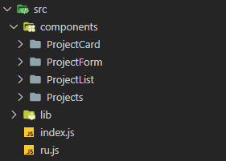
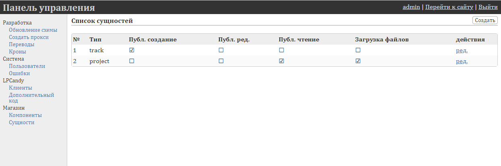
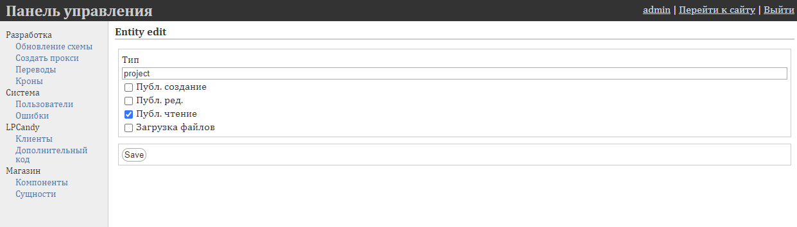

# Пошаговая инструкция по созданию компонента Projects

# Настройка окружения

Для начала разработки необходимо развернуть приложение LPCandy

Код и инструкция по установке доступны на GitHub - [https://github.com/boomyjee/lpcandy](https://github.com/boomyjee/lpcandy)

Также, API документация доступна по ссылке - [https://github.com/boomyjee/lpcandy/blob/master/development_ru.md](https://github.com/boomyjee/lpcandy/blob/master/development_ru.md). Здесь вы можете ознакомиться с Api эндпоинтами и введением в разработку компонентов для LPCandy

# Компонент Projects


Для нашего примера необходимо реализовать 4 основных компонента: 

**Projects** - Секция для отображения списка проектов, с заголовком и описанием

**ProjectCard** - Компонент для отображения одного проекта

**ProjectList** - Это страница в панели администратора, на которой будут отображаться сущности проектов, которые нужны для хранения в базе данных информации о проектах

**ProjectForm** - Страница редактирования сущности проекта

Соответственно структура на данном этапе будет выглядеть следующим образом:



## Projects

Теперь приступим к реализации компонента Projects. Для этого в папке `components/Projects` создадим 2 новых файла: `Projects.js` и `Projects.tea`. В файл `Projects.js` добавим следующий код:

```jsx
require("./Projects.tea");

const {Block} = require("../../../lpcandy/front/editor/components/internal"); 

class Projects extends Block {
 
    static get title() { return _t('Projects') }
    static get description() { return _t('List of projects') }

    constructor(props) {
        super(props);
    }

    componentDidMount() {}

    configForm() {} 

    tpl_1(val) {
        return html`<div>Projects</div>`
		}

    tpl_default_1() {
        return config.language == 'en' ? {} : {}
    }
} 

exports.Projects = Projects;
```

Здесь главная задача определить каркас нашего компонента, который наследуется от внутреннего компонента Block и переопределяет его методы. 

Теперь подключим этот компонент в файле `projects/index.js`, после изменений он должен выглядеть следующим образом:

```jsx
window.lpcandyRun(()=>{
	  window._t.load(require("ru.js"));

    const {Projects} = require('./components/Projects/Projects');
    const {Block} = require("../lpcandy/front/editor/components/internal/Block/Block");
    
    Block.register('projects',exports = Projects);
});
```

Также на данном этапе необходимо зарегистрировать наш компонент для отображения и дальнейшего использования/тестирования компонента в редакторе.

Следующим шагом будет добавить путь к файлу `index.js` в конфиге `bergamot.config.js` и указать путь компиляции:

```jsx
let js_transform = (js) => js.replace(/([>`}])(\s*\n\s*)([<`\$])/mg,"$1$3").replace(/\s*\n\s*/mg,' ')

module.exports = {
    lpcandy: {
        entry_point: "lpcandy/front/site/index.js",
        bundle_path: "lpcandy/public/assets/lpcandy.min.js",
        js_transform
    },
    projects: {
        entry_point: "src/index.js",
        bundle_path: "build/projects.min.js",
        js_transform
    }
}
```

Выполняем команду `bergamot build lpcandy projects`

Для дальнейшего тестирования, скомпилированный файл необходимо подключить на странице редактора. Подключение компонентов находится в файле `lpcandy/modules/LPCandy/template/front.php`

```php
<?
    $home_domain = \Bingo\Config::get('config','domain')[bingo_get_locale()];        
    $home_page = \LPCandy\Models\Page::findOneByDomain($home_domain);
    $user = \LPCandy\Models\User::checkLoggedIn();
?>
<!doctype html>
<html>
<head>
    <meta charset="utf-8" />
    <meta name="viewport" content="width=device-width, initial-scale=1.0, maximum-scale=1.0, user-scalable=no">
    <link id="favicon" rel="icon" type="image/png" sizes="64x64" href="assets/images/lpcandy.png" /> 
    <title>LPCandy</title>
    <script src="<?=INDEX_URL?>/assets/lpcandy.min.js"></script>
    <link  href="<?=INDEX_URL?>/assets/lpcandy.min.css" rel="stylesheet" type="text/css">
    
    **<script src="<?=INDEX_URL?>/../build/projects.min.js"></script>
    <script src="<?=INDEX_URL?>/../build/projects.min.css"></script>**

...
```

Теперь наша секция будет доступна в модальном окне выбора блоков.

Далее зададим, для нашего компонента, конфиг форму с настройками и данные по умолчанию, которые будут использоваться в шаблоне.

```jsx
const {Block, Dialog} = require("../../../lpcandy/front/editor/components/internal"); 

class Projects extends Block {

		... 

    configForm() {
        var val = this.value;
        return html`
            <${Dialog}>
                <${Switch} name="show_title" label="${_t("Show first title")}" /> 
                <${Switch} name="show_title_2" label="${_t("Show second title")}" /> 
                <${Switch} name="show_thumbnail" label="${_t("Show image")}" /> 
                <${Switch} name="show_name" label="${_t("Show name")}" /> 
                <${Switch} name="show_desc" label="${_t("Show description")}" />  
                <${Switch} name="show_case_button" label="${_t("Show case button")}" /> 
                <label>${_t("Button text:")}</label>
                <${Input} name="button_text" />
                <label>${_t("Background color:")}</label>
                <${BlockColor} name="background" />
            <//>
        `;
    } 

		...

    tpl_default_1() {
        return config.language == 'en' ? {
            show_title: true,
            show_title_2: true,
            show_thumbnail: true,
            show_desc: true,
            show_case_button: true,
            background: '#F7F7F7',
            title: "Cases - how we do things",
            title_2: "Over 6 years we have implemented 102 projects and here are some real cases",
            button_text: "Read Case",
            items: [],
        } : {
            show_title: true,
            show_title_2: true,
            show_thumbnail: true,
            show_desc: true,
            show_case_button: true,
            background: '#F7F7F7',
            title: "Наш подход к решению задач",
            title_2: "За 5 лет мы успели сдать 97 проектов и вот несколько типовых историй",
            button_text: "Читать кейс",
            items: [],
        }
    }
} 
```

Теперь пришла очередь написать разметку для нашего компонента. Для этого в файле `Projects.js` добавим следующий код

```jsx
const {Block,Text,BlockColor,Switch,Input,Dialog,Repeater} = require("../../../lpcandy/front/editor/components/internal"); 
const {Select} = require("../../../lpcandy/front/editor/components/internal/Select/Select"); 
const {ProjectCard} = require("../ProjectCard/ProjectCard"); 

class Projects extends Block {
 
		...

    constructor(props) {
        super(props);
				this.state = {
            projects: []
        };
    }

    tpl_1(val) {
        return html`
        <div class="container-fluid projects projects_1 ${val.items.length === 0 ? 'empty' : ''} " style="background: ${val.background};">
            <div class="container">
                <div class="row">
                    <div class="col-12">
                        ${val.show_title && html`
                        <h1 class="title"> 
                            <${Text} name="title" options=${Text.plain_text}/>
                        </h1>
                        `}
                        ${val.show_title_2 && html`
                            <div class="title_2"> 
                                <${Text} name="title_2" options=${Text.plain_text} />
                            </div>
                        `}
                        <div class="item_list clear"> 
                            <div class="item_datas">
                                ${this.state.projects.length > 0 && html`
                                    <${Repeater} 
                                        inline=${true}
                                        repeaterDefault=${() => {
                                            return {project_id : this.state.projects[0].id}
                                        }} 
                                        name="items" 
                                        configForm=${html`
                                            <${Dialog} title=${_t("Projects")}>
                                                <label>${_t('Select a project')}</label>
                                                <${Select} name="project_id">
                                                    ${this.state.projects.map((project)=>html`
                                                        <option value=${project.id}>${project.title}</option>
                                                    `)}
                                                <//>
                                            <//>
                                        `}
                                    >${item_val => html`
                                        <${ProjectCard} 
                                            project=${this.state.projects.find(one => one.id === parseInt(item_val.project_id))}
                                            block_value=${val}
                                        //>
                                    `}<//>
                                `}
                                ${this.state.projects.length === 0 && html`
                                    <div class="projects-empty-message">
                                        ${_t('Projects are empty. Please add some projects using control panel!')}
                                    </div>
                                `}
                            </div>
                        </div>
                    </div>
                </div>
            </div>
        </div>
		`}

    ...
} 
```

Чтобы всё работало корректно, для начального состояния компонента необходимо определить массив projects. В нём будут храниться все ваши проекты.

## ProjectCard

Создайте новый файл `/ProjectCard/ProjectCard.js`

Большая часть кода это HTML для отображения одного отдельного проекта. Следует отметить, то что для форматирования текста описания мы будем использовать markdown. Все файлы библиотек, которые дополнительно используются в компоненте, должны находится в папке `projects/lib`

```jsx
const {Dialog} = require("../../../lpcandy/front/editor/components/internal");
const marked = require('../../lib/marked');

exports.ProjectCard = ({project,block_value}) => {
    const dialog = preact.hooks.useRef(null);

    return project && html`
        <div class="col-4"> 
            <div class="item">
                <div class="item_data">
                    ${block_value.show_thumbnail && html`
                        <div class="img_wrap">
                            <div class="img">
                                
                            </div>
                        </div>
                    `}
                    <div class="name">
                        ${project.title}
                    </div>
                    ${block_value.show_desc && html`
                        <div class="desc">
                            ${project.excerpt}
                        </div>
                    `}
                </div>
                <div class="item_action">
                    <div class="btn_wrap"> 
                        <a 
                            class="btn_form blue" 
                            href="#" 
                            onClick=${(e)=>{
                                e.preventDefault();
                                dialog.current.open();
                            }}
                        >
                            ${block_value.button_text}
                        </a>
                        <${Dialog} ref=${dialog} scrollable=${true} class="projects-card-dialog" width="940" overlayColor="rgba(0,0,0,0.5)">
                            <div class="container">
                                <div class="case_header">
                                <h1 class="title"> 
                                    ${project.title}
                                </h1>
                                </div>
                                <div class="case_content">
                                    <div class="template" dangerouslySetInnerHTML=${{__html: project.text ? marked(project.text) : ''}} />
                                </div>
                            </div>
                        <//>
                    </div>
                </div>
            </div>
        </div>
    `;
}
```

## ProjectForm

Для того чтобы мы смогли добавлять проекты и получать информацию о них, необходимо создать страницу создания\редактирования сущности.

Для этого создайте файл `ProjectsForm/ProjectForm.js`, и поместите в него следующий код:

```jsx
const {EntityForm} = require("../../../lpcandy/front/site/components/EntityForm/EntityForm");
const {FormContext,Error,Text,TextArea} = require("../../../lpcandy/front/site/components/Form/Form");
const {UploadButton} = require("../../../lpcandy/front/editor/components/internal/UploadButton/UploadButton");

const MarkdownTextArea = (props) => {
    const textareaRef = preact.hooks.useRef();
    return html`
        <${FormContext.Consumer}>${(form)=>html`
            <${TextArea} ref=${textareaRef} name=${props.name} />

            <${UploadButton.Type} label=${_t('Select file')} onChange=${(url) => {
                let textareaEl = textareaRef.current.base;
                let value = textareaEl.value;
                let selectionStartPos = textareaEl.selectionStart;
                let selectionEndPos = textareaEl.selectionEnd;

                textareaEl.value = 
                    value.substring(0, selectionStartPos) + 
                    ` *Image caption*`+ 
                    value.substring(selectionEndPos, value.length); 

                textareaEl.dispatchEvent(new Event('change'));
            }} />
            <${Error} name=${props.name} />
        `}<//>
    `;
}

const Thumbnail = (props) => html`
    <${FormContext.Consumer}>${(form)=> html`
        ${form.value[props.name] && html`
            <div class="thumb">
                
            </div>
        `}
        <${UploadButton.Type} label=${_t('Select file')} onChange=${(url) => {
            form.setValue({[props.name]: url});
        }} />
        <${Error} name=${props.name} />
    `}<//>
`;

const ProjectForm = (props) => html`
    <${EntityForm} 
        ...${props}
        class="project-edit-form"
        validate=${(value)=>{
            let errors = {};
            if (!value.thumb) errors.thumb = _t('field is required');
            if (!value.title) errors.title = _t('field is required');
            if (!value.excerpt) errors.excerpt = _t('field is required');
            return errors;
        }}
    >
        <div class="form_field">
            <div class="form_title">
                <label>${_t('Image')}</label>
            </div>
            <${Thumbnail} class="thumb" name="thumb" />
        </div>
        <div class="form_field">
            <div class="form_title">
                <label>${_t('Title')}</label>
            </div>
            <${Text} name="title" />
        </div>
        <div class="form_field">
            <div class="form_title">
                <label>${_t('Short description')}</label>
            </div>
            <${TextArea} name="excerpt" />
        </div>
        <div class="form_field large_textarea">
            <div class="form_title">
                <label>${_t('Text')}</label>
            </div>
            <${MarkdownTextArea} name="text" />
        </div>
        <div class="form_field large_textarea">
            <button type="submit">${props.id ? _t('Save project') : _t('Create project')}</button>
        </div>
    <//>
`;

exports.ProjectForm = ProjectForm;
```

В этом компоненте мы задаём основные поля, которые необходимы для хранения информации о проекте, также проводим валидацию и при необходимости, можем добавить дополнительные компоненты формы. В нашем примере мы добавили 2 компонента MarkdownTextArea, поскольку мы используем markdown для форматирования текста и Thumbnail, поскольку нам необходимо загрузить миниатюру для проекта

## ProjectList

Также для для вывода, фильтрации и удаления проектов создадим новый файл `ProjectList/ProjectList.js`

```jsx
const {EntityList} = require("../../../lpcandy/front/site/components/EntityList/EntityList");

function ProjectList(props) {
    return html`<${EntityList}
        ...${props}
        class="projects-list"
        fields=${{
            id: _t('#'), 
            title: _t('Title'), 
            excerpt: _t('Short description'), 
            thumb: _t('Thumbnail')
        }}
        field_filters=${{
            thumb: (val) => {
                if (!val) return;
                return html`
                    <div class="thumb">
                        
                    </div>
                `;
            }
        }}
        item_actions=${{
            [_t('delete')]: function (item) { this.delete(item) },
            [_t('edit')]: function (item) { this.edit(item) }
        }}
        page_actions=${{
            [_t('new project')]: function (item) { this.edit() }
        }}
        sort_fields=${['id','page','status','created','ip']}
    />`;
}

exports.ProjectList = ProjectList;
```

В данном компоненте, необходимо указать поля, которые необходимо отобразить, поля по которым будет происходить сортировка, добавить возможность удалять и переходить на страницу редактирования сущности

После последних изменений наш index.js должен выглядеть следующим образом:

```php
window.lpcandyRun(()=>{
    window._t.load(require("ru.js"));

    const {Projects} = require('./components/Projects/Projects');
    const {ProjectList} = require('./components/ProjectList/ProjectList');
    const {ProjectForm} = require('./components/ProjectForm/ProjectForm');
    const {Entity} = require("../lpcandy/front/site/Entity");
    const {Block} = require("../lpcandy/front/editor/components/internal/Block/Block");
    
    Block.register('projects',exports = Projects);
    
    Entity.register('project',class extends Entity {
        static get menuLabel() { return _t('Projects') }
        static get label() { return  _t('My Projects') }
        static get labelMultiple() { return _t('My Projects') }
        static get listComponent() { return ProjectList }
        static get formComponent() { return ProjectForm }
    });
});
```

Здесь мы регистрируем новую сущность проект, теперь её также необходимо добавить и в панели управления, для этого необходимо перейти на страницу `/admin/lpcandy/entity-list`



Нажимаем на кнопку `Создать` и переходим на страницу редактирования сущности



Указываем тип сущности, который мы указали при регистрации в `projects/index.js`, задаём для него ограничения на доступ и нажимаем на кнопку `Save`. После чего, появится возможность добавлять новые проекты используя созданные нами страницы.

Теперь мы можем получить проекты из базы данных, используя апи. Добавим соответствующий код в компонент `Projects`

```jsx
class Projects extends Block {

		...

    componentDidMount() {
        let searchCriteria = { type: 'project' };
        if (window.Editor.instance.props.viewOnly) {
            searchCriteria.id = this.value.items.map(one => parseInt(one.project_id));
        }

        window.SiteApp.fetchApi(
            "entity-list",
            searchCriteria,
            ({list}) => this.setState({projects:list})
        );
    }

		...
```